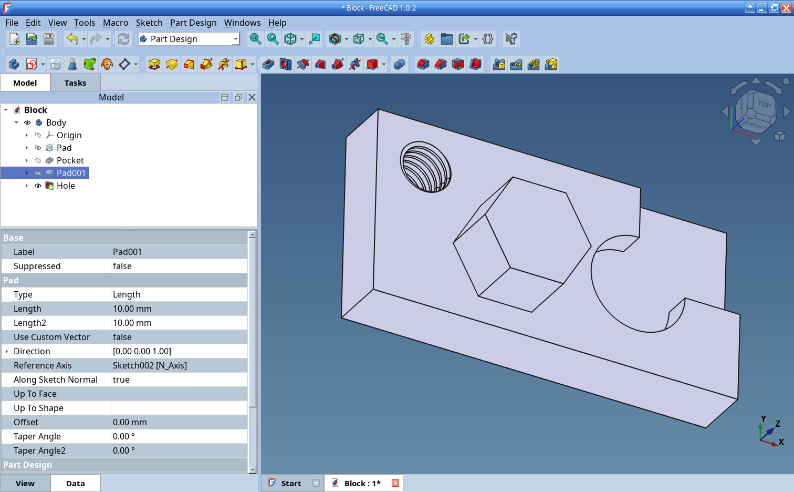
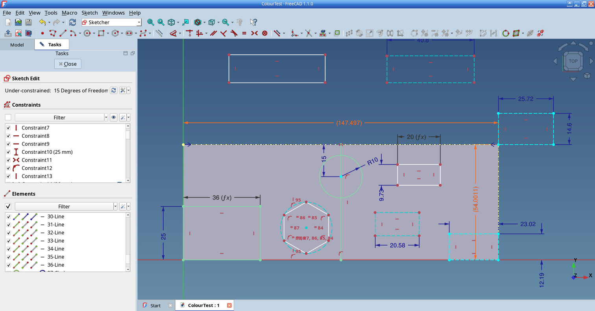

# MikesBlueTheme
## A Blue Theme for FreeCAD Version 1.0 and Version 1.1

## Background
By default, FreeCAD ships with three themes.\
FreeCAD Light - a bacic light theme.\
FreeCAD Dark - a basic dark theme.\
and FreeCAD Classic which uses the Local Operating System Fonts and Colours.\
Settings for the internal UI inside FreeCAD can be modified by the user but custom changes to menus and layouts are more complex thus requiring a dedicated system theme.

## Reason for this Theme
I'm not a great fan of dark themes so I was using the FreeCAD Classic Theme which has the look and feel of my operating system.\
Ever since the early days of Windows 95/98 and XP etc, blue has been a dominant colour so I decided to make my own FreeCAD Theme using the look and feel of a classic operating system but with a modern twist.\
The result is MikesBlueTheme.\
It should work under all Operating Systems.  I use Linux - hence the Tux Icon when installed via the Addon Manager.\
This is MikesBlueTheme, I hope you like it.

## Colours
FreeCAD's Light and Dark Themes incorporate appropriate UI colours that best fit the dark and light background colours.\
Whilst designing MikesBlueTheme, it was clear that the default UI colours for the Sketcher wouldn't work with my selected blue background.\
So I have changed the Sketcher Colours as follows:-

Unconstrained Geometry is White\
Constrained Geometry is Dull Green\
Construction Unconstrained Geometry is Light Blue\
Construction Constrained Geometry is Lighter Blue\
External Geometry is Yellow\
Fully Constrained Sketch is Bright Green\
Invalid Sketch is Red\
Constraint Symbols are Dark Yellow\
Dimensions are Dark Yellow\
Referenced Constraints are Dark Yellow\
New Elements are Grey

In my opinion, the above colours provide clean easy to read sketches but can be altered in the usual way using Edit Preferences - Sketcher - Appearance.

This is an example of a simple Sketch using MikesBlueTheme.

## How to find MikesBlueTheme
Run FreeCAD\
Edit Preferences - Addon Manager - Add Custom Repository (+ sign) and enter the following\
Repository URL - https://github.com/mikerothery/MikesBlueTheme  
Branch - main  
Apply - OK\
Tools - Addon Manager\
For Filter, Select - Preference Pack\
Refresh Local Cache\
You will find MikesBlueTheme in the list of Preference Packs.

If you have found MikesBlueTheme using the Addon Manager, you will already have entered the above steps.

## How to Install MikesBlueTheme
Run FreeCAD\
Tools - Addon Manager\
For Filter, Select - Preference Pack\
Refresh Local Cache\
You will find MikesBlueTheme in the list of Preference Packs.\
Select it\
Install it

## How to Acvivate MikesBlueTheme
Run FreeCAD\
Edit Preferences - General\
Change Theme to MikesBlueTheme\
Apply - OK\
Enjoy

## Note
Edit Preferences - Display - UI\
Style sheet (advanced) will show that MikesBlueTheme is being used.

## Finally Changes for Different Resolutions
The Marker (the size of the vertex etc. in the Sketcher)\
Edit Preferences - Display - 3D View - Marker Size\
Set to 9px for a 1920 x 1080 (Standard 1K) display\
Set to 13px for a 2160 x 1440 (Surface Pro) display 

## Contact
If you have any comments, please email me on mike@maidencombe.com

All the best  
Mike

